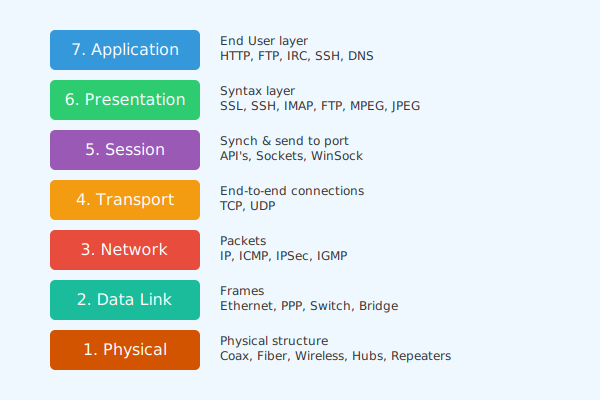

<p align="center">
    <a href="https://en.wikipedia.org/wiki/OSI_model">
      
    </a>
</p>

# [PCAP](https://en.wikipedia.org/wiki/Pcap) Feature [Extractor](https://en.wikipedia.org/wiki/Packet_analyzer) Toolkit
[]()
[]()

<p align="center">
    <a href="https://github.com/cybersecurity-dev/"></a>
    &nbsp;
    <a href="https://www.youtube.com/@CyberThreatDefence"></a>
    &nbsp;
    <a href="https://cyberthreatdefence.com/my_awesome_lists"></a>
    
</p>


<details>

<summary>Install required tools on Linux</summary>

### For Ubuntu 18.04, 20.04, 22.04

```bash
sudo apt-get update
```
</details>


<details>

<summary>Install required tools on Windows</summary>

### For Windows 11

```powershell
```
</details>


<details>

<summary>Install required python libs</summary>

### pip install
```script
pip install -r requirements.txt
python3 setup.py install
```

### conda install
```script
conda config --add channels conda-forge
conda install --file requirements_conda.txt
python3 setup.py install
```

</details>


## OSI Layers
[](https://cyberthreatdefence.com/)


**From PCAP to CSV File Extractor**


##

### Contributing

[Contributions of any kind welcome, just follow the guidelines](contributing.md)!

### Contributors

[Thanks goes to these contributors](https://github.com/cybersecurity-dev/PCAP-Toolkit/graphs/contributors)!

[🔼 Back to top](#pcap-feature-extractor-toolkit)
